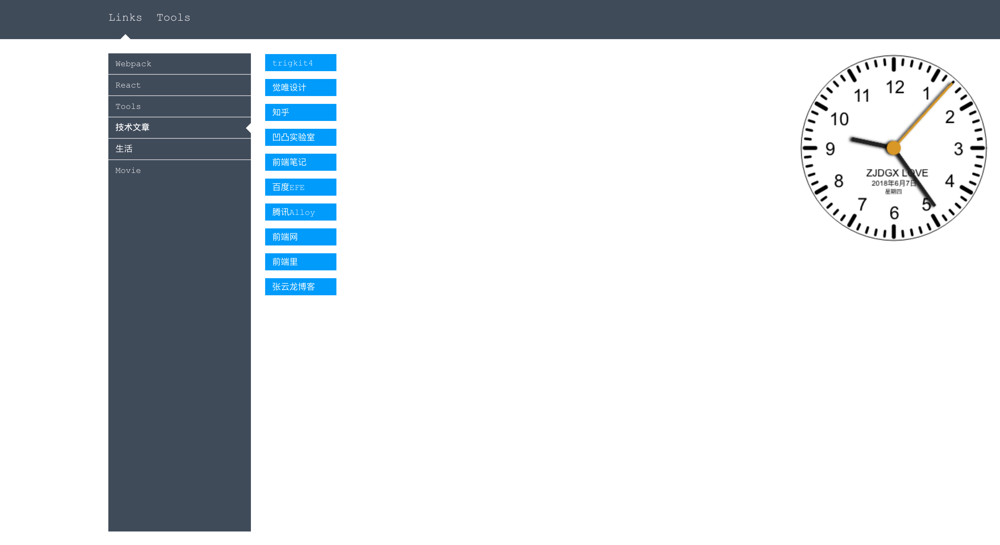

# Front-End Chrome Extension

前端开发chrome插件，欢迎star、PR

## 2018/06/07
  1. 修改分类切换样式
  2. clock位置修改

## 2018/06/05
  1. 添加less支持: `lessc -x newTab.less > newTab.min.css`
  2. 添加二维码
  3. 添加颜色转换
  4. 整理样式
  5. 水波按钮

## 集成扩展
  1. [Chrome商店](https://chrome.google.com/webstore/category/extensions?hl=zh-CN)添加扩展
  2. [查看扩展ID](chrome://extensions)
  3. 打开扩展安装目录
    - MAC: /Users/{mac_user}/Library/Application Support/Google/Chrome/Default/Extensions

## 开发扩展
  1. 官方文档: https://developer.chrome.com/extensions
  2. 中文入门: http://web.jobbole.com/93256/?utm_source=blog.jobbole.com&utm_medium=relatedPosts